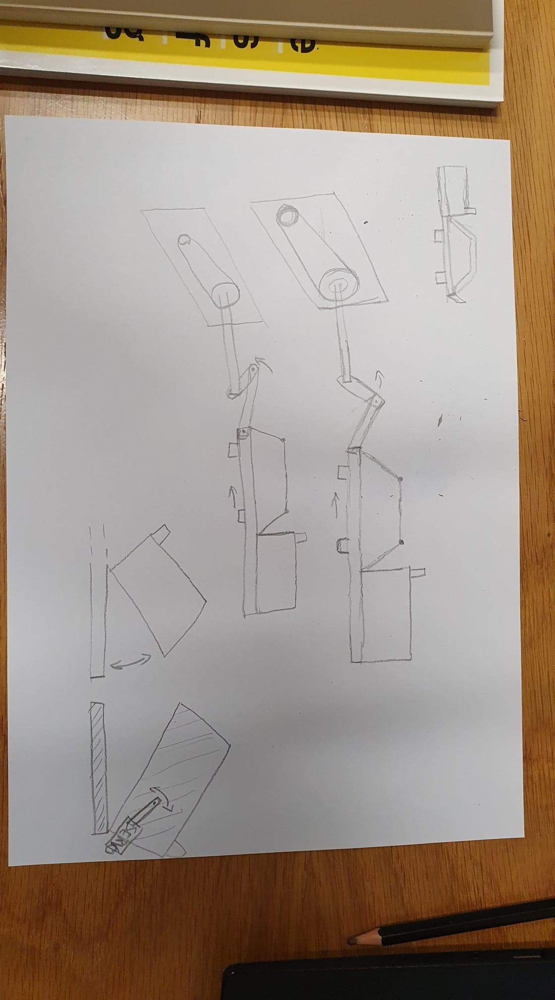
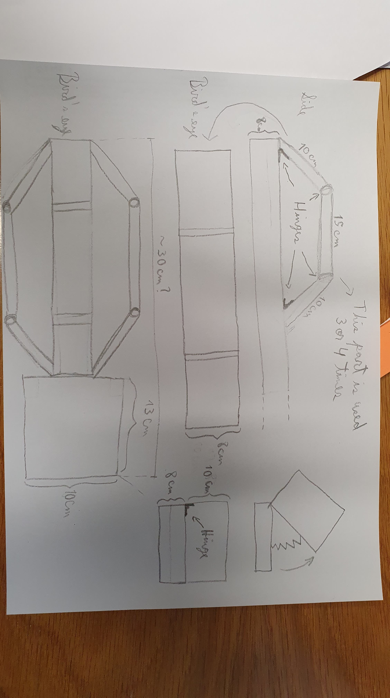

# THIS IS THE MIDTERM PROJECT ABOUT A HIPPO MADE OUT OF METAL..!

## INTRODUCTION AND EARLY DRAFT

-For my midterm project, I wanted to create a moving automaton that resembled a Hippopotamus and was made out of metal. Why? I thought it was a cool idea. 

-However, it was not to be a very realistic Hippo. This creature would be able to inflate and deform its body while its mouth opens and closes. The core movement of the automaton is in the expansion and contraction of the torso. Early in the semester I made a cardboard prototype of this idea to satisfactory results. Because the piece of wood I used as support for the prototype was sticking out and because the expansion and contraction of the torso looked like a breathing motion, I put a little 'fire' inside the Hippo's mouth. The fire covers the ugly piece of wood from sticking out of its mouth, but also gives the hippo a sense of extraordinariness that compliments its ability to distort its torso. 

A short video of the prototype can be downloaded and viewed [here](https://github.com/Carlos-A-Paez-G/MachineLab/blob/master/MIDTERM/Fire%20Hippo%20Vid.mp4)

## MIDTERM CHANGES

-When transitioning from the cardboard prototype to the midterm project, there were two things I needed to incorporate: the use of both a stepper motor and a servo motor, and I wanted to move from cardboard to metal (aluminium). The following image shows a general idea of what I wanted the final product to look like and where it would incorporate the two motors. 

-The stepper motor is inserted in the frame with pulleys that we made separately for class. The stepper motor would turn and move the hippo back and forth using a contraption similar to the one in the cardboard draft. Missing in this diagram is a frame that would be placed right where the hippo starts and the spinning contraption ends. This would be stuck to a base and would hold everything in place by locking the movement of the hippo's center piece to be able to move with only one degree of freedom. 

-A small servo motor would be hidden inside the hippo's large mouth and it would be screwed to the head of the hippo, making it move up and down. This would control the movement of the hippo's mouth, meaning that the body and the mouth would have been able to move asynchronously.

-Making the body out of metal meant that much thought needed to be given to the movement that the hippo would be able to do, mostly provided by hinges. This isn't shown in the diagram underneath, but it is observable in the draft video: the rear ends of the body would be stuck to the frame that limits the movement of the hippo's center piece (it would still need a hinge, but it would NOT be screwed to the center of the hippo, which is what the next diagram currently shows). The opposite ends would be screwed via a hinge to the center piece. This means that the front of the body would move back and forth while the back stays in place. When this happens, the torso responds with movement via hinges (pictured below) that hold it together and allow the front and back parts to rotate to compensate vertically for the change in the horizontal dimension. That re-creates the expansion and contraction motion that I was looking for in the draft. **The torso is then made up of three or four of these contraptions that move up and down as the base, which is a long rigid bar that connects the entire automaton, shifts back and forth.**

-The head of the hippo would then also need a hinge (pictured below as well) to allow for its rotational movement of openning and closing. In a corner of the following image you will see the mouth being open with a zig-zag joining the two ends: this is the evolution of the fire that hid the center piece in the cardboard draft. It would be a piece of either painted cardboard or some kind of sturdy paper that would be stuck to the two ends of the mouth and then fold and unfold as the mouth openned. Primarily, it hides the servo and any internal mechanisms. Aesthetically, maybe it would be fire again... Though because this time it is not portruding outwards, maybe I would have instead made it look like the hippo had something inside its mouth through whatever image is on this foldable paper. Maybe it would have been a universe inside the hippo's mouth. From fire-breathing to existence-breathing.

## EXPECTED CHALLENGES

-**Screws**: The pieces of metal we were able to work with were really thin! So when screwing things together, I feel like it would have been difficult to cover up certain portruding screws, particularly with the servo to the head, as the screws would have had to point towards the outside of the head. Maybe I could have found a way to justify these aesthetically, or maybe I would have found a way to wrap the hippo in something so that these awkward imperfections remain hidden.

-**Size**: The sizes stated in the diagram are estimates. There two main things that I think might become an issue with the size. The first is that the servo motor might not even fit inside the hippo's mouth. If the servo is too small, maybe it would not have the torque to move the mouth, and if it is too big it might mean that everything needs to become bigger to make room. This leads to the second problem, which is that the larger the automaton becomes the harder it would be for the stepper motor to move it back and forth. Of course, all the metal would be thin pieces or hollow larger pieces, but I would probably have needed some trial and error to find the ideal size for the automaton.

-**Cables**: The cables for the servo motor need to go somewhere. The arduino would be placed behind the frame with the stepper motor, so then the cables would have to come out from there. I've been thinking that maybe the center piece of the hippo would be hollow and the cables could go through it and then have a cavity to come out of at the mouth. The only thing that concerns me then is that the cables must be somehow separated to the contraption the stepper motor controls, in order to avoid them getting tangled with it. Maybe there is an easy solution, or maybe the cables would need to find an alternate route to the mouth, as the back of the center piece is very close to the contraption that moves it back and forth.
