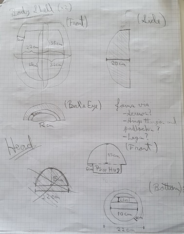
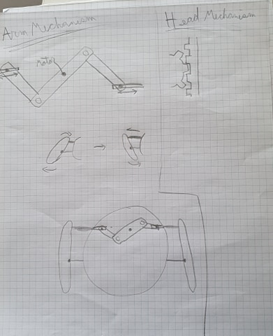
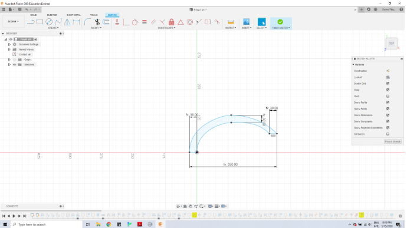
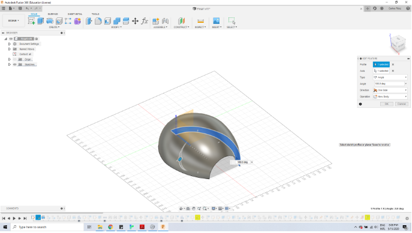
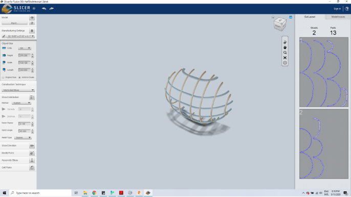
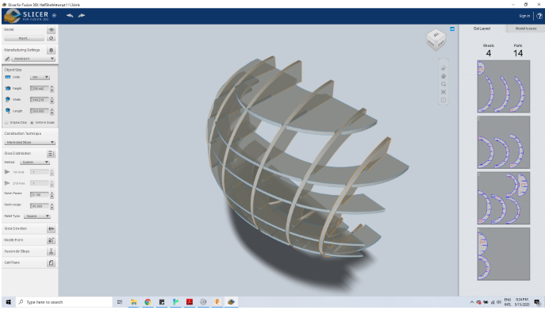
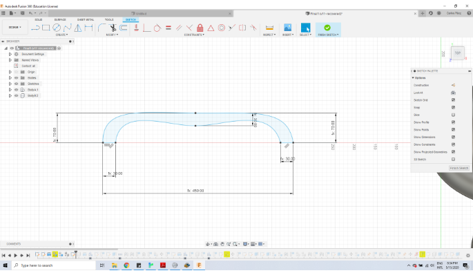
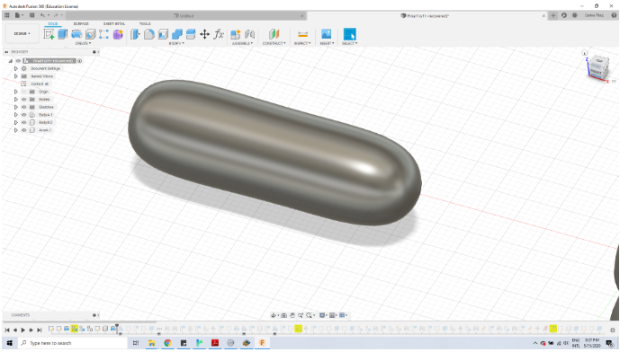
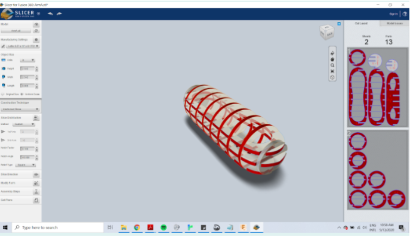
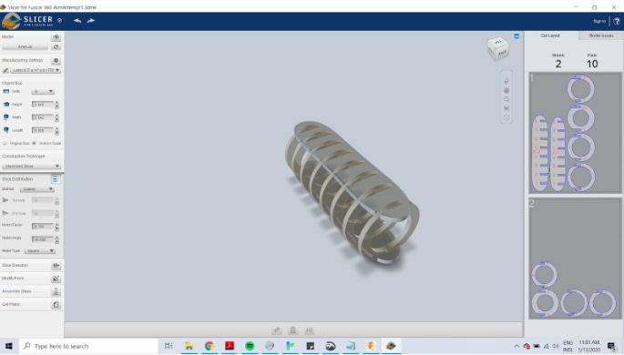

# Final - Journal

### Early Concept (March)

**Location relative to clock:** on the floor? Maybe down where the 6 would be or maybe off to the side.

**Base:** I would like it to not have a base. I would like all the mechanisms to be hidden inside the hug-bot, so maybe the inside needs a lot of bases and supports, but I would like the bot itself to support via the "legs".

**Motors:** A stepper motor for the head poppin up, another stepper motor (or maybe two?) for the arms moving outwards from the body, and two servo motors for the arms closing in on the person.

**Fabrication of parts:** Great question... I think what I wonder is how possible is it to make curves happen and then what is the tools that I would need for that to happen.

**What materials will you use:** Aluminum?

**Different levels of activity:** The head slowly comes up until its intended time when it is fully up and then it can give hugs. Maybe from that moment onwards it starts to close and if it closes all the way without receiving a hug it gets sad or something. Maybe it can give multiple hugs during the given time frame and the more hugs it gives something special happens. 

### Designing Individual Pieces (April)

#### Body Shell

The body of the robot will be comprised of an outer shell made of two parts that join together. Inside this outer shell will be where all the mechanisms of the robot hide, so it needs to be spacious enough to contain the Arduino, the motors, the cables, and anything else that it needs to function. The shell also needs to be big, as this is the part that the users will hug. With all this in mind, an initial measurement for the shell is 35cm tall, 32cm wide (at its widest point) and 20cm deep (meaning that the two shells together would make the robot have a circumference of 40cm total). With these measurements, and assuming the material used - hopefully aluminum) is 5cm (which is an overestimation) it should leave enough space inside for the mechanisms to fit properly.

A couple of notes on the shell. Firstly, the two halves must be joined using something that allows them to be easy separated, so that the robot can be opened up and worked on without too much of a hassle. For this purpose, maybe a hinge lock (like the ones you close off with a pad-lock) could serve the purpose. Otherwise, bolts that are easily accessible and can be removed easily could do the trick too. Secondly, the inside of the shell must not be empty - it should contain bases and slots for the Arduino and the mechanisms to fit and hold themselves inside without falling apart. These are two things I hope to come back to later.

#### Head

The robot’s head moves up slowly as time passes, and when the robot’s activation time arrives, it will be fully lifted up, showing a sign underneath it that says “Free Hug”. The head will also probably have eyes painted on it, to make the robot more friendly. The robot head will be 15cm tall, meaning that in total the robot will be about 50cm tall. The diameter of the head should be about the same as the diameter of the top of the body shell, as then it can rest on it instead of falling through. This part will probably need to be hollow, as that will reduce its weight and make it easier to lift using a motor.

#### Arm Mechanism

At first, I had thought of using two Servo motors to move the arms side to side, putting the motors inside the arms. The reason I wanted to put the motors inside the arms is that I reasoned that the closer the motors were to the center of the arms, the less torque they would have to generate to make them move (since angular momentum is inversely proportional to the distance between the force and the center of mass of the object being moved). However, I realized eventually that this did not make much sense, since the Servo being inside the arm meant that it would not be able to push off of anything. It would be like trying to push a car to move forward from inside the car… 

Therefore, I realized that I needed a different way of pushing the arms sideways. After asking Michael, I found out that a good mechanism would be a reverse linkage system, such as the first one illustrated on this page http://www.technologystudent.com/cams/link1.htm. 

The mechanism shown on the sketch not only requires only one motor, but it also makes sure that both arms move at the same rate. It would also be inside the body, so it should not run into the problem of not having anything to push from as long as it is fastened to the shell and the base is stable on the floor. 

Here’s how it should work: A central linkage would be rotated directly by the motor, pushing two other linkages on opposite sides. The two other linkages would have their ends attached to rails that would restrict their movement to one dimension. As the ends of the linkages move away from the center, they push out the back of the arm (which would have a piece attached to it, linking it to the shell and the same rail as the linkage). As the back of the arms get pushed outwards, the center of the arms would be held in place by a piece that is fixed to the center shell. This should allow the arm to pivot from its center, so that when it is pushed from the back it closes in on its front. This whole mechanism would activate when the robot is hugged, would hold there for a moment, and then move out again in order to let the person go. 

#### Head Mechanism

The head would be moved up and down using a rack and pinion (this one also came from a conversation with Michael: http://www.technologystudent.com/cams/link1.htm). This one is fairly straightforward - the pinion is turned directly by the motor, pushing the rack up or down depending on whether the robot is preparing to hug or has been hugged. It is important that the motor and the rack are properly fastened to the shell, in order to keep everything from falling and to be able to overcome the gravity on the head.

### Modeling in Fusion 360

#### Making The Body Shell

The first thing I made using Fusion 360 was the outer shell. I made it by making a sketch of the outer shell in 2D and then using revolute to make the shell appear. 

One issue with making the shell was that I wasn’t sure what would be used to make it. The shape itself could be easily 3D printed, but I thought it would be too large and 3D printing it would require making it in separate parts and then linking those together. Not to mention that it might take a really long time. So after conferring with Michael, he suggested that I should use a waffle construction method. And then we found an extension for Fusion 360 that takes a model and does it automatically called Slicer. (https://apps.autodesk.com/FUSION/en/Detail/Index?id=8699194120463301363&os=Mac&appLang=en)! So I downloaded it and imported the model into Slicer and got this: 

This is actually after having worked on it a little bit. Originally, it had many more slices, but many of them showed up red, meaning they had errors in them that would make it impossible to construct. For example, one of the pieces had a slit that went through the entire model, so the piece would be broken when fabricated. So I deleted a few pieces that I didn’t think would be necessary and arrived at what’s on the image. When I showed it to Michael, he said that it seemed a bit too flimsy, which I agree with. So I tried playing around with Slicer and trying to make the parts thicker, but I ended up making a mess and the parts were distorted and ate up the space that needed to be left inside the shell. So, instead I decided to go back into Fusion and make the shell thicker (the images I showed from Fusion were actually of this thicker model) and I imported that instead and got a much better result.

#### Making the arms

Once the shell was done, I decided to tackle the arms, since the method for making them in Fusion 360 would be very similar. Similarly made the profile view of the arms and then revoluted them. Since the arms did not need to have much inside of them, I simply made the whole model at once.

It took several iterations to arrive at this model for the sketch. In other versions, I had gone for a profile that looked much more like the one for the body shell, which was more like a half oval. However, when making the revolute, this caused the shape to be very pointy and look unnatural on each end. This is why in the end I made a shape that had a sharper angle at the edges, so that the final shape was softer as well. 

I then placed the arms on Slicer. However, I quickly ran into a big issue because of the fact that the model is a full cylinder.

All of the pieces highlighted in red will not work in actuality because they would require another piece to go through them, because the pieces had slots in both the inside and the outside that needed to be fitted into by the same piece. The solution that I came up with for this was to remove all the longitudinal pieces in the center and simply leave ones in the top and bottom that would hold together all of the center rings. The arm could then later be covered with some material that would hide this skeleton. 

#### Designing the arms mechanism

Creating the mechanism for the arms took quite a bit of trial and error and ultimately I am not satisfied with what I have modeled at the moment. However, what I have went through a long journey of improvement and ultimately it gets most of the idea across and needs very few tweaks to be sent in for fabrication.

I started off by simply creating the different pieces that would join together. I got a shaft from McMaster Carr, which might be what I attach to the central linkage to make it turn with the motor. Then I made the three linkages and joined them together with revolute joints. I made two rectangles that would serve as the rail and I made a sort of bolt with a wheel (a tall cylinder attached to a short wide cylinder), which is what attaches to the rail to move back and forth with a slider joint. I also another piece that attaches to the rail which would then be attached to the arms and push them back and forth. 

This first attempt did not really work. When turning on collision and grounding the rails, nothing would move. I tried changing the parameters of the parts to see if anything might make it work, but I could not find a systematic way to troubleshoot the problem efficiently. So I just decided to open a new Fusion file and make the system again from scratch.

This time it went a lot better. Everything is pretty much the same as last time, except this time I also made a piece that joins together the linkages and the piece that attaches to the arm. In this model, the arms are also attached to the ends of the pieces, so it shows how they will move back and forth with the linkages.

[[Linkages image]]

I tried to attach a piece in the middle that would allow the arms to pivot in the middle and close in the front when pushed out in the back, but when I tried grounding the central piece, it did not work. I tried to ask Dustin to see if he might know the solution to it, but he couldn’t seem to figure it out either. 

[[Linkages 2.0 video]]

[[Linkages picture]]

### Working on the head mechanism

For the head, I decided to use a vertical rack and pinion. I imported models of these from McMaster Carr, but ultimately did not have time to figure out how to implement them into Fusion 360. Here is an image of the early model I made for the head and the imported models of the rack, pinion, and stepper motor that would be used in the head mechanism.

[[Head image]]

[[rack and pinion image]]

Despite this I had some time to think about what the process of actually making this mechanism would be like. So I did some research as to what it would be like to set up a vertical rack and pinion mechanism and I came across this image: 

[[Vertical rack and pinion]]

From looking at this image, I could deduce that I would need a frame that would keep the rack from moving in any direction but up and down. It would also be good if the same frame could hold the motor. Attaching the pinion directly to the motor also seems like a good idea, since it will probably give the most possible torque to the structure (a note for everything in this project is that it makes sense in pretty much all cases to prioritize torque over speed for the motors, since nothing needs to move too fast). This structure would also need to be attached to the shell. In order to keep the rack from falling off the structure, since this probably wants to be as high as possible in the shell, to leave the lower area for the arms mechanism, I will probably want to find a way to attach the rack to the head. Since the head is larger than the hole for the rack in the frame, if the two are attached together the head should keep the rack from falling off. These could be attached by using a metal piece that is screwed on one end to the rack and on another end to the head.

## Further thoughts

### Legs (or Base)

In my very first drawing, I showed the robot standing with two triangular legs. These legs will probably just be made out of three pieces of aluminium that will be joined together using L-brackets. They would then be attached to the center body. It would be ideal for the pieces that make up the legs to be as wide as possible, maybe about 10cm would be enough length. This is just to ensure that the robot has enough support, since the arms are quite long (which they need to be since they need to protrude outwards and be able to hug a whole person in front of the body shell).

### Attaching things

The waffle construction method might actually provide an easy way to attach the components of the machine to the body as a whole. Rather than needing to plan ahead with additional holes for everything in the shell and the arms, each component can be simply be bolted into the pieces that make up the arm and the body. Anything that needs to be placed perpendicular to these, such as the center pivot for the arms, and the rack and pinion frame can be connected using an L-bracket. Anything that goes parallel, such as the rails of the hugging mechanism and the base for the arduino and the motor of the hugging mechanism would be joined using a straight piece of aluminium that would have two bolts holding it onto each piece.

The base that contains the Arduino and the hugging mechanism would be near either the bottom or the middle of the body. This base will probably be a round sheet of metal or maybe wood that covers the entire body and that can simply lay there inside the robot. How high this base is depends on the hugging mechanism and how tall the shaft that will make the center linkage move. This base will contain a frame for the motor that it can safely operate the shaft. The Arduino might also want to be bolted to this base, which would make it easier to transport the robot when necessary.

In order to join the two halves of the body shell, I would need to find a way to make it easy to detach so the inside can be worked on whenever needed. The hinge locks that I had mentioned earlier might still do the trick, I might just need several in order to join together the different parts of the body skeleton. I think four hinge locks would be the ideal number, as this would allow me to lock the two different sides of the robot together and then also have them connect on two different levels on each side. If not, at minimum it would need one hinge lock on either end of the shell, so that it does not open up on the unlocked side.

L-brackets can also be used to support any parts of the waffle structure that isn’t securely fastened by itself. 

### Remaining questions

At the moment, I am not quite sure how the Arduino code will work. I assume that the code will have the motor be for the head push it up a little based on the time (I assume Arduino has a way of getting and reading time?) or based on milliseconds. The only thing that I don’t know much of is how the Arduino is going to recognize that the robot is being hugged. One easy solution for this is that the robot could just give a hug at the corresponding hour and to disregard whether or not there is actually someone there. This would be relatively easy to implement, but I would also like the robot to respond with different reactions depending on whether it was hugged or not. If I can find a way to have a pressure sensor at the front of the robot, then as soon as there is someone pressuring the sensor (hopefully with their chest as they hug the robot) it would activate a hugging sequence. Then, maybe using NeoPixels that can be attached to the face of the robot, I can make the robot simulate expressions such as joy or sadness, to express whether it was hugged or not. It would all depend on the limitations of time and space.

Another thing that probably needs to be done is to cover up the robot. This is something that doesn’t necessarily need to be done, since having the visible skeleton of the robot might be an interesting artistic effect. But, since this piece will be open to anybody who enters the Arts Center, it would be better to cover it up, as not doing so might invite people to mess around with the structure and if anything inside the robot gets pushed around it might stop working. Therefore, it might be a good idea to make a sort of “clothes” for the robot. This would consist of fabric to cover the body and the arms, probably either velcroed or zipped so that it can easily be taken off if needed. This fabric coating would also contain holes that would allow any parts that need to come out (such as the mechanisms moving and holding the arms in place) to still move around as needed. 

